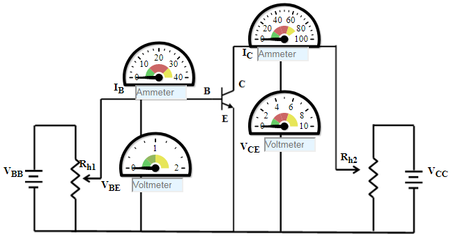

### Procedure

### BJT Common Emitter - Input Characteristics
1. Initially set rheostat Rh1 = 1 &#937; and rheostat Rh2 = 1 &#937;
2. Set the Collector-Emitter Voltage(VCE) to 1 V  by adjusting the rheostat Rh2
3. Base Emitter Voltage(VBE) is varied  by adjusting the rheostat Rh1.
4. Note the reading of Base current(IB)in micro Ampere.
5. Click on 'Plot' to plot the I-V characteristics of Common-Emitter configuration. A graph is drawn with VBE along X-axis and IB along Y-axis.
6. Click on 'Clear' button to take another sets of readings 
7. Now set the Collector-Emitter Voltage(VCE) to 2 V, 3 V, 4 V
                                    

Figure:1

### BJT Common Emitter - Output Characteristics
1. Initially set rheostat Rh1 = 1 &#937; and rheostat Rh2 = 1 &#937; 
2. Set the Base current(IB)15 uA by adjusting the rheostat Rh1 
3. Vary the  Collector-Emitter Voltage(VCE)is varied  by adjusting the rheostat Rh2.
4. Note the reading of Collector current(IC).
5. Click on 'Plot' to plot the I-V characteristics of Common-Emitter configuration. A graph is drawn with VCE along X-axis and IC along Y-axis.
6. Click on 'Clear' button to take another sets of readings
7. Now set the Base Current(IB) to 20 uA

Figure: 2

