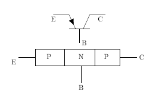

# Theory

### Structure of Bipolar Junction Transistor
A bipolar junction transistor, BJT, is a single piece of silicon with two back-to-back P-N junctions.BJTs can be made either as PNP or as NPN.

Figure 1: Structures, layers and circuit symbol of NPN transistor  

They have three regions and three terminals, emitter, base, and collector represented by E, B, and C respectively. The direction of the arrow indicates the direction of the current in the emitter when the transistor is conducting normally. An easy way to remember this is NPN stands for "Not Pointing iN".

Figure 2: Structures, layers and circuit symbol of PNP transistor  

**Emitter (E):** It is the region to the left end which supply free charge carriers i.e., electrons in n-p-n or holes in p-n-p transistors.These majority carriers are injected to the middle region i.e. electrons in the p region of n-p-n or holes in the n region of p-n-p transistor. Emitter is a heavily doped region to supply a large number of majority carriers into the base.
**Base (B):** It is the middle region where either two p-type layers or two n-type layers are sandwiched. The majority carriers from the emitter region are injected into this rgion.This region is thin and very lightly doped.
**Collector (C):** It is the region to right end where charge carriers are collected.The area of this region is largest compared to emitter and base region . The doping level of this region is intermediate between heavily doped emitter region and lightly doped base region.

#### Note

1. In digital electronics applications,the transistors are used as a switch.
2. Most bipolar switching circuits use NPN transistors.

### Operation of Bipolar Junction Transistor

Figure 3: Four Operating Conditions  

**Cutoff Region:** Base-emitter junction is reverse biased. No current flow.
**Saturation Region:** Base-emitter junction is forward biased and Collector-base junction is forward biased.
**Active Region:** Base-emitter is junction forward biased and Collector-base junction is reverse biased.
**Breakdown Region:** IC and VCE exceed specifications and can cause damage to the transistor.

### Cut-Off Region

In Cut-Off region both junctions are reverse biased, Base-emitter junction is reverse biased (VBE<0)and also Collector-Base junction is reverse biased(VCB>0).With reverse biasing, all currents are zero.There are some leakage currents associated with reverse biased junctions,but these currents are small and therefore can be neglected.
Application: Open switch

### Forward Active Region

In Forward Active region Base-emitter junction is forward biased (VBE<0) and Collector-Base junction is reverse biased(VCB<0). In this case, the forward bias of the BE junction will cause the injection of both holes and electrons across the junction. The holes are of little consequence because the doping levels are adjusted to minimize the hole current. The electrons are the carriers of interest. The electrons are injected into the base region where they are called the minority carrier even though they greatly outnumber the holes.
Application:Amplifier in analog circuits

$$I_C=−α_F×I_E+I_{CO}$$

where,
αF is the forward current transfer ratio
ICO is Collector reverse saturation current

### Saturation Region

In Saturation region both junctions are Forward biased,Base-emitter junction is forward biased(VBE>0) and also Collector-Base junction is forward biased(VCB<0). Maximum currents flows through the transistor with only a small voltage drop across the collector junction.The transistor also does not respond to any change in emitter current or base-emitter voltage.
Application:Closed switch

### Reverse Active Region

In Reverse Active region Base-emitter junction is reverse biased(VBE<0) and Collector-Base junction is forward biased(VCB<0).The operation is just the same as the forward active region, except all voltage sources, and hence collector and emitter currents, are the reverse of the forward bias case. The current gain in this mode is smaller than that of forward active mode for which this mode in general unsuitable for amplification.
Application:In digital circuits and analog switching circuits.

$$I_E=−α_R∗I_C+I_{EO}$$

where,
αR is the reverse current transfer ratio\newline IEO is the Emitter reverse saturation current

This configuration is rarely used because most transistors are doped selectively to give forward current transfer ratios very near unity, which automatically causes the reverse current transfer ratio to be very low.

### BJT -Common Emitter Circuit

The DC behavior of the BJT can be described by the Ebers-Moll Model. The equations for the model are:

$$I_F= I_{ES}  ( exp^ \frac{V_{BE}}{V_T} -1)$$

$$I_R= I_{CS} (exp^ \frac{V_{CB}}{V_T} -1)$$

where,
IES is base-emitter saturation currents,
ICS is base-collector saturation currents

$$V_T=\frac{kT}{q}$$

where,
k is the Boltzmann’s constant ( k = 1.381 e-23 V.C/ K ),
T is the absolute temperature in degrees Kelvin, and
q is the charge of an electron (q = 1.602 e-19 C).

$$&#946;_F = \frac{&#945;_F}{1 - &#945;_F}$$

$$&#946;_R=  \frac{&#945;_R}{1 - &#945;_R}$$

where,
βF is large signal forward current gain of common-emitter configuration,
βR is the large signal reverse current gain of the common-emitter configuration

 $$&#945;_F=\frac{&#946;_F}{1 + &#946;_F}$$
                           
$$&#945;_R=\frac{&#946;_R}{1 + &#946;_R}$$

where,
αR is large signal reverse current gain of a common-base configuration,
αF is large signal forward current gain of the common-base configuration.

 $$I_C =  &#945;_F \times  I_F - I_R$$
                            
$$  I_E = -I_F + &#945;_R * I_R$$
$$ I_B = (1 - &#945;_F) \times I_F + (1 - &#945;_R) \times I_R$$

The forward and reverse current gains are related by the expression

$$α_R \times I_{CS}= α_F \times I_{ ES} =I_S$$

where,
IS is the BJT transport saturation current.
The parameters αR and αF are influenced by impurity concentrations and junction depths. The saturation current, IS, can be expressed as 

$$I_S = J_S \times A$$

where,
A is the area of the emitter and
JS is the transport saturation current density

### Input Characteristics

The most important characteristic of the BJT is the plot of the base current, IB, versus the base-emitter voltage,VBE, for various values of the collector-emitter voltage,VCE
$$I_B=ϕ(V_{BE},V_{CE}) for constant V_{CE}$$

Figure 4: Input Characteristics Circuit  

### Output Characteristics

The most important characteristic of the BJT is the plot of the collector current, IC, versus the collector-emitter voltage, VCE, for various values of the base current, IB as shown on the circuit on the right.

$$I_C=ϕ(V_{CE},I_B)$$  for constant IB

Figure 5: Output Characteristics Circuit  

